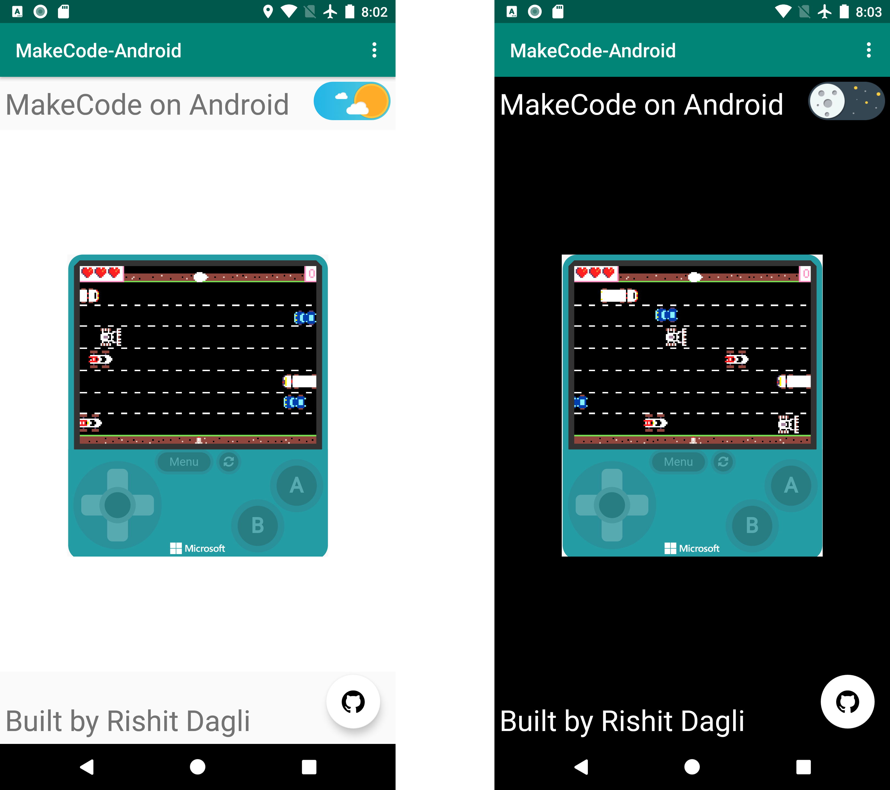
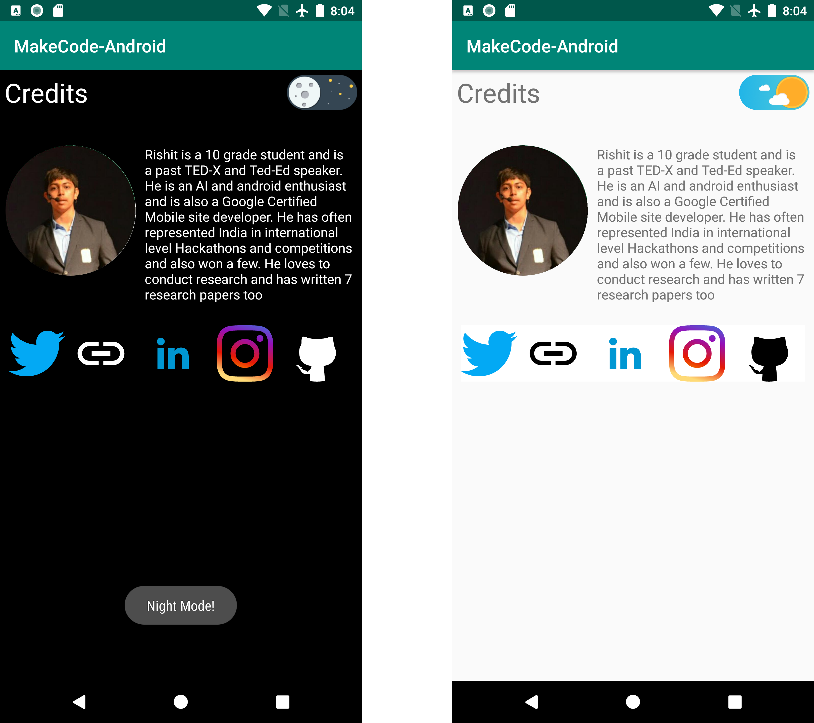

# MakeCode-Android


[](https://dev.azure.com/rishitdagli/MakeCode-Android/_build/latest?definitionId=1&branchName=master)
<!-- ALL-CONTRIBUTORS-BADGE:START - Do not remove or modify this section -->
[](#contributors-)
<!-- ALL-CONTRIBUTORS-BADGE:END -->

This project is completely inspired by [Microsoft Build 2020 Student Zone](https://github.com/microsoft/StudentsAtBuild). From the 
wonderful talks presented at  [Microsoft Build 2020 Student Zone](https://github.com/microsoft/StudentsAtBuild) about [Microsoft MakeCode Arcade](https://arcade.makecode.com/), 
I noticed that there was no native suppport or any such tool to convert or run the games made in
MakeCode in Android or IoS. This project shows how you could run your MakeCode project on Android (IoS support coming soon!). 
The project is completely **beginner friendly** which means even if you don't know about Android, you can still get the project up and 
running (Detailed instructions meantioned below)

If you have contributed in any form to this project, reporting [Issues](https://github.com/Rishit-dagli/MakeCode-Android/issues) and/or
opening [Pull Requests](https://github.com/Rishit-dagli/MakeCode-Android/pulls) find your name and photo at [Contributors ✨](#contributors-)

## What this document contains

- [MakeCode-Android](#makecode-android)
  * [What to expect](#what-to-expect)
  * [Tools Used](#tools-used)
  * [Using this Project](#using-this-project)
    + [1. Fork this repository :fork_and_knife:](#1-fork-this-repository-fork_and_knife)
    + [2. Clone this repository :busts_in_silhouette:](#2-clone-this-repository-busts_in_silhouette)
    + [3. Set it up :wrench:](#3-set-it-up-wrench)
    + [4. Editing this Project for your needs](#4-editing-this-project-for-your-needs-gear)
      - [Open project in your preferred editor](#open-project-in-your-preferred-editor)
      - [Understanding files which you should care about](#understanding-files-which-you-should-care-about)
      - [Editing files](#editing-files)
        * [Step 1](#step-1)
        * [Step 2](#step-2)
        * [Step 3](#step-3)
  * [Contributing](#contributing)
    + [1. Ready, Set, Go!!! :turtle::rabbit2:](#1-ready-set-go-turtlerabbit2)
    + [2. Create a new branch :bangbang:](#2-create-a-new-branch-bangbang)
    + [3. Push your awesome work to your remote repository :rocket:](#3-push-your-awesome-work-to-your-remote-repository-rocket)
    + [4. Finally, make a PR! :fire:](#4-finally-make-a-pr-fire)
  * [Contributors ✨](#contributors-)
## What to expect

This project shows you how you could set up an Android project with a good UI, in very little time. You should expect to be able to run 
your MakeCode example in this manner-





Everything you see on the screen is completely customizable. While this document we will refer the first image here as `Page 1` and the
second one as `Page 2` of the app.

## Tools Used

* [MakeCode Arcade](https://arcade.makecode.com/) to build the major Arcade game
* Code built using [Kotlin](https://kotlinlang.org/)
* UI built using [XML](https://en.wikipedia.org/wiki/XML)
* Open-source build automation using [Gradle](https://gradle.org/)
* CI for Gradle Builds using [GitHub Actions](https://github.com/features/actions)
* CI for Gradle Builds and UI Tests using [Azure Pipelines](https://azure.microsoft.com/en-us/services/devops/pipelines/)
* [Figma](https://www.figma.com/) to design the images

## Using this Project

### 1. Fork this repository :fork_and_knife:

You can get your own fork/copy of [MakeCode-Android](https://github.com/Rishit-dagli/MakeCode-Android) by using the <a href="https://github.com/Rishit-dagli/MakeCode-Android/new/master?readme=1#fork-destination-box"><kbd><b>Fork</b></kbd></a> button or clicking [here](https://github.com/Rishit-dagli/MakeCode-Android/new/master?readme=1#fork-destination-box).
 [](https://github.com/CoderJolly/IPU-Engineering-Notes)
 
 
### 2. Clone this repository :busts_in_silhouette:
You need to clone (download a copy of) this repository to your local machine using:
```sh
$ git clone https://github.com/Your_Username/MakeCode-Android.git
```
> This makes a local copy of repository in your machine.
Once you have cloned the `MakeCode-Android` repository in GitHub, move to that folder first using change directory command on linux and Mac.
```sh
# This will change directory to a folder MakeCode-Android
$ cd MakeCode-Android
```
Move to this folder for all other commands.

### 3. Set it up :wrench:
Run the following commands to see that *your local copy* has a reference to *your forked remote repository* in GitHub :octocat:
```sh
$ git remote -v
origin  https://github.com/Your_Username/MakeCode-Android.git (fetch)
origin  https://github.com/Your_Username/MakeCode-Android.git (push)
```
Now, lets add a reference to the original [MakeCode-Android](https://github.com/Rishit-dagli/MakeCode-Android) repository using
```sh
$ git remote add upstream https://github.com/Rishit-dagli/MakeCode-Android.git
```
> This adds a new remote named ***upstream***.
See the changes using
```sh
$ git remote -v
origin    https://github.com/Your_Username/MakeCode-Android.git (fetch)
origin    https://github.com/Your_Username/MakeCode-Android.git (push)
upstream  https://github.com/marwahmanbir/MakeCode-Android.git (fetch)
upstream  https://github.com/marwahmanbir/MakeCode-Android.git (push)
```

### 4. Editing this Project for your needs :gear:

#### Open project in your preferred editor

You can essentially open the project in any editor but I would advise you to have an editor which can have a virtual device so you can 
test out your project locally. The editors I would suggest are-

* [VS Code](https://code.visualstudio.com/) is one of the best editors and you can have all you need with it. It is best if your machine
does not have very great specs, its is pretty light weight too.
* [Android Studio](https://developer.android.com/studio) is the officially preferred editor for Android development, however it might 
require your machine to have great specs to run it efficiently.

#### Understanding files which you should care about

There are majorly two files you would have to edit:

* [colors.xml](app/src/main/res/values/colors.xml)

This is the file where you would edit the colors you need for your app.

* [strings.xml](app/src/main/res/values/strings.xml)

You would majorly focus on editing this as most of the content would be built for you from here

A few other files:

* [MainActivity.kt](https://github.com/Rishit-dagli/MakeCode-Android/blob/master/app/src/main/java/tech/rishit/makecode_android/MainActivity.kt) - The file used to write the Kotlin code for Page 1
* [Credits.kt](https://github.com/Rishit-dagli/MakeCode-Android/blob/master/app/src/main/java/tech/rishit/makecode_android/credits.kt)- The file used to write the Kotlin code for Page 2
* [activity_main.xml](https://github.com/Rishit-dagli/MakeCode-Android/blob/master/app/src/main/res/layout/activity_main.xml)- The UI code for Page 1
* [activity_credits.xml](https://github.com/Rishit-dagli/MakeCode-Android/blob/master/app/src/main/res/layout/activity_credits.xml)- The UI code for Page 2

#### Editing files

##### Step 1

Open [strings.xml](app/src/main/res/values/strings.xml), edit each of the values according to this table

|Name|Purpose|
|----|----|
|app_name|The name that appears in top bar
|project_name|The name that appears under the top bar
|githubproject_url|Your MakeCode project GitHub URL
|footer_description|Footer on Page 1
|profile_picture_url|Your profile picture URL on Page 2
|bio|Your bio
|github_profile|Your personal GitHub profile
|twitter_url|Your Twitter URL
|website|Your website link
|linkedin_profile|Your LinkedIn profile URL
|insta_profile|Your Instagram profile URL

##### Step 2

Navigate to [MainActivity.kt](app/src/main/java/tech/rishit/makecode_android/MainActivity.kt), Line 69.
add your project id in the following format:

```kotlin
"id=[PROJECT_ID] "
```

Eg. If your shareable URL is `https://makecode.com/_df5TAVWsvJ4d` then your `project_id` would be `_df5TAVWsvJ4d`

##### Step 3

Open [colors.xml](app/src/main/res/values/colors.xml), edit any colors if you need to

**And now you are all done your app is ready :smiley: .** In case you face any error while doing so or any errors in the app, you are
welcome to report them [here](https://github.com/Rishit-dagli/MakeCode-Android/issues).

## Contributing

### 1. Ready, Set, Go!!! :turtle::rabbit2:
Once you have completed these steps, you are ready to start contributing by checking our `Help Wanted` Issues and creating [pull requests](https://github.com/Rishit-dagli/MakeCode-Android.git/pulls).

### 2. Create a new branch :bangbang:
Whenever you are going to make contribution. Please create separate branch using command and keep your `master` branch clean (i.e. synced with remote branch).
```sh
# It will create a new branch with name Branch_Name and switch to branch Folder_Name
$ git checkout -b Folder_Name
```
Create a separate branch for contribution and try to use same name of branch as of folder.
To switch to desired branch
```sh
# To switch from one folder to other
$ git checkout Folder_Name
```
To add the changes to the branch. Use
```sh
# To add all files to branch Folder_Name
$ git add .
```
Type in a message relevant for the code reviewer using
```sh
# This message get associated with all files you have changed
$ git commit -m 'relevant message'
```
### 3. Push your awesome work to your remote repository :rocket:
```sh
# To push your work to your remote repository
$ git push -u origin Folder_Name
```
### 4. Finally, make a PR! :fire:
Go to your repository in browser and click on `compare and pull requests`.
Then add a title and description to your pull request that explains your precious effort.

## Contributors ✨

Thanks goes to these wonderful people ([emoji key](https://allcontributors.org/docs/en/emoji-key)):

<!-- ALL-CONTRIBUTORS-LIST:START - Do not remove or modify this section -->
<!-- prettier-ignore-start -->
<!-- markdownlint-disable -->
<table>
  <tr>
    <td align="center"><a href="https://www.rishit.tech"><br /><sub><b>Rishit Dagli</b></sub></a><br /><a href="https://github.com/Rishit-dagli/MakeCode-Android/commits?author=Rishit-dagli" title="Code">💻</a></td>
    <td align="center"><a href="https://blog.iamprins.com"><br /><sub><b>Ricardo Prins</b></sub></a><br /><a href="https://github.com/Rishit-dagli/MakeCode-Android/commits?author=ricardoprins" title="Documentation">📖</a></td>
  </tr>
</table>

<!-- markdownlint-enable -->
<!-- prettier-ignore-end -->
<!-- ALL-CONTRIBUTORS-LIST:END -->

This project follows the [all-contributors](https://github.com/all-contributors/all-contributors) specification. Contributions of any kind welcome!
